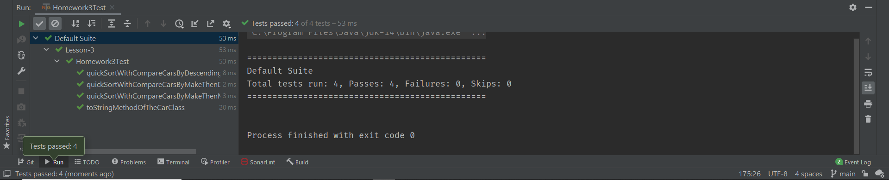

# Homework Assignment 3
## Data Structures and Algorithms in Java (CSE-41321)
### UCSD Extension (Summer 2021)
#### Problem Statement

This program utilizes an implementation of the quicksort algorithm to sort an array of objects of the Car class. The Car class is composed of three fields specifying a vehicle's noticed how make, model and EPA rating (i.e., average MPG). The quicksort algorithm was provided courtesy of Raymond Mitchell III, and was used without modification. Except for the test class, all source code for this assignment is contained in a class called Homework3. In addition to the quicksort implementation, the source code might contain additional data structures and algorithms appropriated from the lecture notes.

The quicksort algorithm accepts two arguments. The first argument to the quicksort method is an array. The second argument is a Comparator. In this exercise, the first argument will be an array of Car objects, and the second argument will be one of three Comparators. The three comparators in this program implement the Comparator interface for Car objects (i.e., Comparator<Car>). The quicksort method arranges the elements of the array in accordance with the precepts of the comparator.

This program includes three implementations of the Comparator interface. The first Comparator, *CompareCarsByMakeThenModel*, arranges Car objects in the list first by make, and then within each make, by model. So, an original list of vehicles like this:

```
Car{make='Toyota', model='Camry', mpg=33}
Car{make='Ford', model='Focus', mpg=40}
Car{make='Honda', model='Accord', mpg=34}
Car{make='Ford', model='Mustang', mpg=31}
Car{make='Honda', model='Civic', mpg=39}
Car{make='Toyota', model='Prius', mpg=48}
Car{make='Honda', model='Fit', mpg=35}
Car{make='Toyota', model='Corolla', mpg=35}
Car{make='Ford', model='Taurus', mpg=28}
```
… after sorting, would look like this:
```
Car{make='Ford', model='Focus', mpg=40}
Car{make='Ford', model='Mustang', mpg=31}
Car{make='Ford', model='Taurus', mpg=28}
Car{make='Honda', model='Accord', mpg=34}
Car{make='Honda', model='Civic', mpg=39}
Car{make='Honda', model='Fit', mpg=35}
Car{make='Toyota', model='Camry', mpg=33}
Car{make='Toyota', model='Corolla', mpg=35}
Car{make='Toyota', model='Prius', mpg=48}
```

The next Comparator, *CompareCarsByDescendingMPG*, arranges Car objects in the array in descending order by EPA rating (i.e., average MPG) – regardless of make or model. So, an array containing Car objects in the following order…
```
Car{make='Toyota', model='Camry', mpg=33}
Car{make='Ford', model='Focus', mpg=40}
Car{make='Honda', model='Accord', mpg=34}
Car{make='Ford', model='Mustang', mpg=31}
Car{make='Honda', model='Civic', mpg=39}
Car{make='Toyota', model='Prius', mpg=48}
Car{make='Honda', model='Fit', mpg=35}
Car{make='Toyota', model='Corolla', mpg=35}
Car{make='Ford', model='Taurus', mpg=28}
```
… after sorting, would look like this:

```
Car{make='Toyota', model='Prius', mpg=48}
Car{make='Ford', model='Focus', mpg=40}
Car{make='Honda', model='Civic', mpg=39}
Car{make='Toyota', model='Corolla', mpg=35}
Car{make='Honda', model='Fit', mpg=35}
Car{make='Honda', model='Accord', mpg=34}
Car{make='Toyota', model='Camry', mpg=33}
Car{make='Ford', model='Mustang', mpg=31}
Car{make='Ford', model='Taurus', mpg=28}
```
The third Comparator, *CompareCarsByMakeThenDescendingMPG*, arranges car objects in the array first by make and then by EPA rating. So, an original list like this:
```
Car{make='Toyota', model='Camry', mpg=33}
Car{make='Ford', model='Focus', mpg=40}
Car{make='Honda', model='Accord', mpg=34}
Car{make='Ford', model='Mustang', mpg=31}
Car{make='Honda', model='Civic', mpg=39}
Car{make='Toyota', model='Prius', mpg=48}
Car{make='Honda', model='Fit', mpg=35}
Car{make='Toyota', model='Corolla', mpg=35}
Car{make='Ford', model='Taurus', mpg=28}
```
… after sorting, would look like this:
```
Car{make='Ford', model='Focus', mpg=40}
Car{make='Ford', model='Mustang', mpg=31}
Car{make='Ford', model='Taurus', mpg=28}
Car{make='Honda', model='Civic', mpg=39}
Car{make='Honda', model='Fit', mpg=35}
Car{make='Honda', model='Accord', mpg=34}
Car{make='Toyota', model='Prius', mpg=48}
Car{make='Toyota', model='Corolla', mpg=35}
Car{make='Toyota', model='Camry', mpg=33}
```
### Source Code
#### Homework3
```java
package cse41321.algorithms;

import java.util.Comparator;
import java.util.Random;

public class Homework3 {

    static class QuickSort {
        public static <T> void quickSort(T[] array, Comparator<? super T> comparator) {
            quickSortRecursive(array, 0, array.length - 1, comparator);
        }

        /**
         * @param array
         * @param i
         * @param k
         * @param comparator
         * @param <T>
         */
        private static <T> void quickSortRecursive(T[] array, int i, int k, Comparator<? super T> comparator) {
            // Stop the recursion when it is not possible to partition further
            if (i >= k) {
                return;
            }

            // Determine where to partition the elements
            int j = partition(array, i, k, comparator);

            // Sort the left partition
            quickSortRecursive(array, i, j, comparator);

            // Sort the right partition
            quickSortRecursive(array, j + 1, k, comparator);
        }

        private static <T> int partition(T[] array, int i, int k, Comparator<? super T> comparator) {

            // Use the median-of-three method to find the partition value
            T p = medianOfThree(array, i, k, comparator);

            // Create two partitions around the partition value
            --i;
            ++k;
            while (true) {
                // Move left until an element is found in the wrong partition
                do {
                    --k;
                } while (comparator.compare(array[k], p) > 0);

                // Move right until an element is found in the wrong partition
                do {
                    ++i;
                } while (comparator.compare(array[i], p) < 0);

                if (i >= k) {
                    // Stop partitioning when the left and right indices cross
                    break;
                } else {
                    // Swap the elements at the indices
                    T temp = array[i];
                    array[i] = array[k];
                    array[k] = temp;
                }
            }

            return k;
        }

        private static <T> T medianOfThree(T[] array, int i, int k, Comparator<? super T> comparator) {

            // Get 3 random values from the array
            Random random = new Random();
            T a = array[random.nextInt(k - i + 1) + i];
            T b = array[random.nextInt(k - i + 1) + i];
            T c = array[random.nextInt(k - i + 1) + i];

            // Return the median of the 3 values
            if (comparator.compare(a, b) > 0) {             // a > b
                if (comparator.compare(b, c) > 0) {         // a > b > c
                    return b;
                } else if (comparator.compare(a, c) > 0) {  // a > c > b
                    return c;
                } else {                                    // c > a > b
                    return a;
                }
            } else {                                        // b > a
                if (comparator.compare(a, c) > 0) {         // b > a > c
                    return a;
                } else if (comparator.compare(b, c) > 0) {  // b > c > a
                    return c;
                } else {                                    // c > b > a
                    return b;
                }
            }
        }
    }

    static class Car {
        private String make;
        private String model;
        private int mpg; // Miles per gallon

        public Car(String make, String model, int mpg) {
            this.make = make;
            this.model = model;
            this.mpg = mpg;
        }

        public String getMake() {
            return make;
        }

        public void setMake(String make) {
            this.make = make;
        }

        public String getModel() {
            return model;
        }

        public void setModel(String model) {
            this.model = model;
        }

        public int getMpg() {
            return mpg;
        }

        public void setMpg(int mpg) {
            this.mpg = mpg;
        }

        @Override
        public String toString() {
            return "Car{" +
                    "make='" + make + '\'' +
                    ", model='" + model + '\'' +
                    ", mpg=" + mpg +
                    '}';
        }
    }


    static class CompareCarsByMakeThenModel implements Comparator<Car> {
        /**
         * @param thisCar
         * @param thatCar
         * @return
         */
        @Override
        public int compare(Car thisCar, Car thatCar) {
            if (thisCar.getMake().compareTo(thatCar.getMake()) != 0) {
                return thisCar.getMake().compareTo(thatCar.getMake());
            } else {
                return thisCar.getModel().compareTo(thatCar.getModel());
            }
        }
    }

    static class CompareCarsByDescendingMPG implements Comparator<Car> {
        /**
         * @param thisCar
         * @param thatCar
         * @return
         */
        @Override
        public int compare(Car thisCar, Car thatCar) {
            // The following statement returns the (additive) inverse of the value produced by the compare method.
            return -(Integer.compare(thisCar.getMpg(), thatCar.getMpg()));
            // I'm not sure why I spent so much time scrounging for an inverse function,
            // when a simple hyphen will suffice.
        }
    }

    static class CompareCarsByMakeThenDescendingMPG implements Comparator<Car> {
        /**
         *
         * @param thisCar
         * @param thatCar
         * @return
         */
        @Override
        public int compare(Car thisCar, Car thatCar) {
            if (thisCar.getMake().compareTo(thatCar.getMake()) != 0) {
                return thisCar.getMake().compareTo(thatCar.getMake());
            } else {
                return new CompareCarsByDescendingMPG().compare(thisCar, thatCar);
            }
        }
    }

    public static void main(String[] arguments) {
        Car[] cars = {
                new Car("Toyota", "Camry", 33),
                new Car("Ford", "Focus", 40),
                new Car("Honda", "Accord", 34),
                new Car("Ford", "Mustang", 31),
                new Car("Honda", "Civic", 39),
                new Car("Toyota", "Prius", 48),
                new Car("Honda", "Fit", 35),
                new Car("Toyota", "Corolla", 35),
                new Car("Ford", "Taurus", 28)};

        System.out.println("\nHere is the list of cars in the original order…\n");
        for (Car car : cars) {
            System.out.println(car);
        }

        QuickSort.quickSort(cars, new CompareCarsByMakeThenModel());
        System.out.println("\nAfter sorting by make then Model…\n");
        for (Car car : cars) {
            System.out.println(car);
        }

        QuickSort.quickSort(cars, new CompareCarsByDescendingMPG());
        System.out.println("\nAfter sorting by descending MPG…\n");
        for (Car car : cars) {
            System.out.println(car);
        }

        QuickSort.quickSort(cars, new CompareCarsByMakeThenDescendingMPG());
        System.out.println("\nAfter sorting by make then descending MPG…\n");
        for (Car car : cars) {
            System.out.println(car);
        }
    }
}
```

#### Homework3Test
```java
package cse41321.algorithms;

import org.testng.annotations.AfterMethod;
import org.testng.annotations.BeforeMethod;
import org.testng.annotations.Test;

import static org.testng.Assert.*;

public class Homework3Test {

    Homework3.Car[] cars = {
            new Homework3.Car("Toyota", "Camry", 33),
            new Homework3.Car("Ford", "Focus", 40),
            new Homework3.Car("Honda", "Accord", 34),
            new Homework3.Car("Ford", "Mustang", 31),
            new Homework3.Car("Honda", "Civic", 39),
            new Homework3.Car("Toyota", "Prius", 48),
            new Homework3.Car("Honda", "Fit", 35),
            new Homework3.Car("Toyota", "Corolla", 35),
            new Homework3.Car("Ford", "Taurus", 28)};

    @BeforeMethod
    public void setUp() {
    }

    @AfterMethod
    public void tearDown() {
    }

    @Test
    public void toStringMethodOfTheCarClass() {
        Homework3.Car car = new Homework3.Car("Toyota", "RAV4", 26);
        assertEquals(car.toString(), "Car{make='Toyota', model='RAV4', mpg=26}");
    }

    @Test
    public void quickSortWithCompareCarsByMakeThenModel() {
        Homework3.QuickSort.quickSort(cars, new Homework3.CompareCarsByMakeThenModel());
        // After sorting, I'm checking only the first and last elements.
        assertEquals(cars[0].getModel(), "Focus");
        assertEquals(cars[cars.length - 1].getModel(), "Prius");
    }

    @Test
    public void quickSortWithCompareCarsByDescendingMPG() {
        Homework3.QuickSort.quickSort(cars, new Homework3.CompareCarsByDescendingMPG());
        // After sorting, I'm checking only the first and last elements.
        assertEquals(cars[0].getModel(), "Prius");
        assertEquals(cars[cars.length - 1].getModel(), "Taurus");
    }

    @Test
    public void quickSortWithCompareCarsByMakeThenDescendingMPG() {
        Homework3.QuickSort.quickSort(cars, new Homework3.CompareCarsByMakeThenDescendingMPG());
        // After sorting, I'm checking only the first and last elements.
        assertEquals(cars[0].getModel(), "Focus");
        assertEquals(cars[cars.length - 1].getModel(), "Camry");
    }
}
```
## Program Output
### Homework3Test (unit tests)

### Homework3 (integration)
```plaintext
Here is the list of cars in the original order…

Car{make='Toyota', model='Camry', mpg=33}
Car{make='Ford', model='Focus', mpg=40}
Car{make='Honda', model='Accord', mpg=34}
Car{make='Ford', model='Mustang', mpg=31}
Car{make='Honda', model='Civic', mpg=39}
Car{make='Toyota', model='Prius', mpg=48}
Car{make='Honda', model='Fit', mpg=35}
Car{make='Toyota', model='Corolla', mpg=35}
Car{make='Ford', model='Taurus', mpg=28}

After sorting by make then Model…

Car{make='Ford', model='Focus', mpg=40}
Car{make='Ford', model='Mustang', mpg=31}
Car{make='Ford', model='Taurus', mpg=28}
Car{make='Honda', model='Accord', mpg=34}
Car{make='Honda', model='Civic', mpg=39}
Car{make='Honda', model='Fit', mpg=35}
Car{make='Toyota', model='Camry', mpg=33}
Car{make='Toyota', model='Corolla', mpg=35}
Car{make='Toyota', model='Prius', mpg=48}

After sorting by descending MPG…

Car{make='Toyota', model='Prius', mpg=48}
Car{make='Ford', model='Focus', mpg=40}
Car{make='Honda', model='Civic', mpg=39}
Car{make='Honda', model='Fit', mpg=35}
Car{make='Toyota', model='Corolla', mpg=35}
Car{make='Honda', model='Accord', mpg=34}
Car{make='Toyota', model='Camry', mpg=33}
Car{make='Ford', model='Mustang', mpg=31}
Car{make='Ford', model='Taurus', mpg=28}

After sorting by make then descending MPG…

Car{make='Ford', model='Focus', mpg=40}
Car{make='Ford', model='Mustang', mpg=31}
Car{make='Ford', model='Taurus', mpg=28}
Car{make='Honda', model='Civic', mpg=39}
Car{make='Honda', model='Fit', mpg=35}
Car{make='Honda', model='Accord', mpg=34}
Car{make='Toyota', model='Prius', mpg=48}
Car{make='Toyota', model='Corolla', mpg=35}
Car{make='Toyota', model='Camry', mpg=33}

Process finished with exit code 0
```
## Postmortem
Initially I was having difficulty figuring out how to use the quicksort method. I think my confusion stemmed from the fact that our first assignment used a function that returned an array – or at least a reference to an array. I guess I was expecting the quicksort method to do the same. I remained stymied while trying to figure out how I was going to get a modified array back from quicksort. Eventually I remembered that the argument I had passed to the quicksort method was a reference, and that quicksort would modify my array "in place." It's amazing how easy it is for me to forget even the most basic concepts!

This project includes a test class, *Homework3Test*, which implements unit tests for the *toString* method of the Car class, as well as each of the three Comparator implementations. During this assignment I learned that, when using the TestNG library for unit testing, I don't have to redirect system output to capture console output generated by methods that invoke System.out.println(). Contrary to my expectations, the assertEquals () methods were intercepting that output automagically. My recollection is that when using the JUnit library, the system output had to be redirected and captured elsewhere. Furthermore, I discovered that the integrated development environment that I use (IntelliJ IDEA) includes built-in support for a variety of testing platforms.

One of my frustrations has been finding an efficient way to merge all of the relevant project documentation into a single PDF file. Well, perhaps I have found a solution!

Several years ago I became acquainted with the Markdown markup language. That's when I first started using it to create and edit README files in my GitHub projects. Good tools for producing Markdown documents were in short supply. That is, until recently. Quite by accident I stumbled across a product called Markdown Monster. Now I'm not knocking the built-in markdown support in IntelliJ IDEA, but it doesn't approach Markdown Monster. It's sufficient for basic tasks, but for more elaborate documents Markdown Monster is preferable. I'm guessing you could do the same with any advanced editor, but I'm giving Markdown Monster a try because it's user interface is simpler.

I've discovered that from within the Markdown Monster editor, I can save the rendered document as a PDF file! So, this assignment represents my first attempt at using Markdown Monster to capture my README file and generate a PDF file worthy of submission.

I've been creating README files for only the last couple of classes, so it's still a work in progress. Consequently, the layout is something that will continue to evolve.

Preparing README files takes so much time that I seldom proofread them. I apologize for any errors or omissions.
